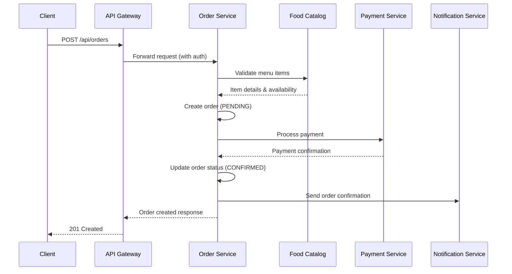
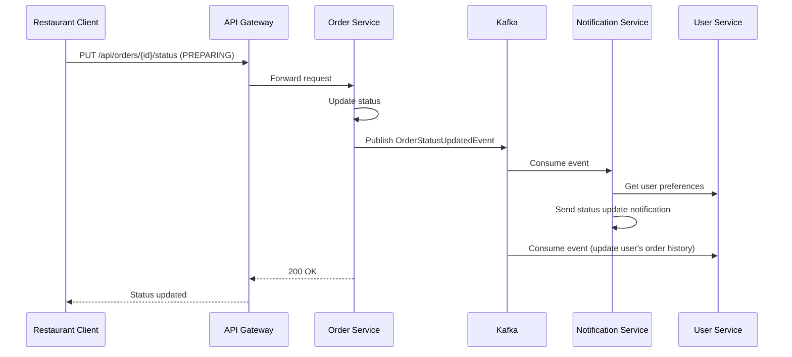
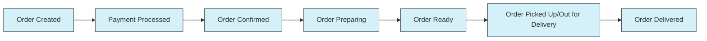
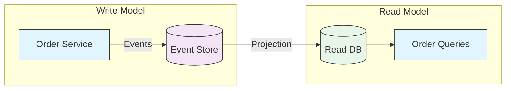
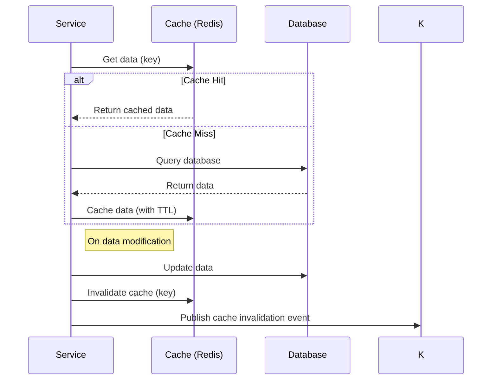
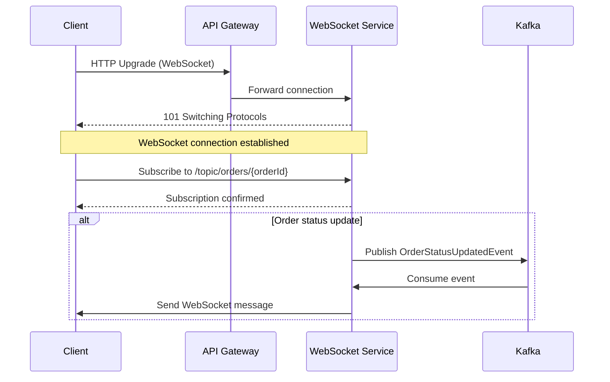
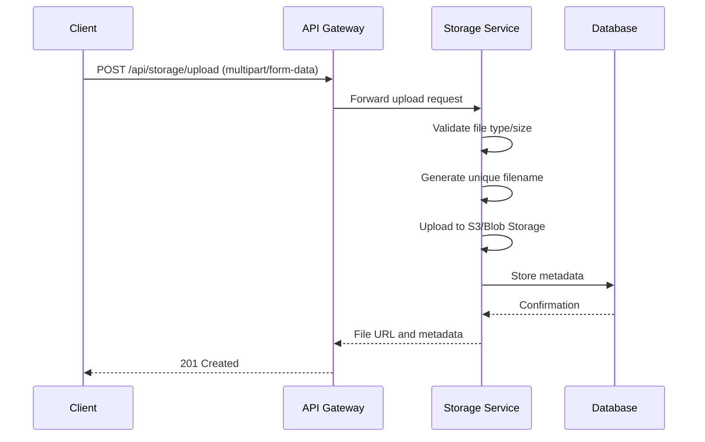
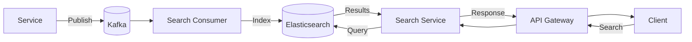
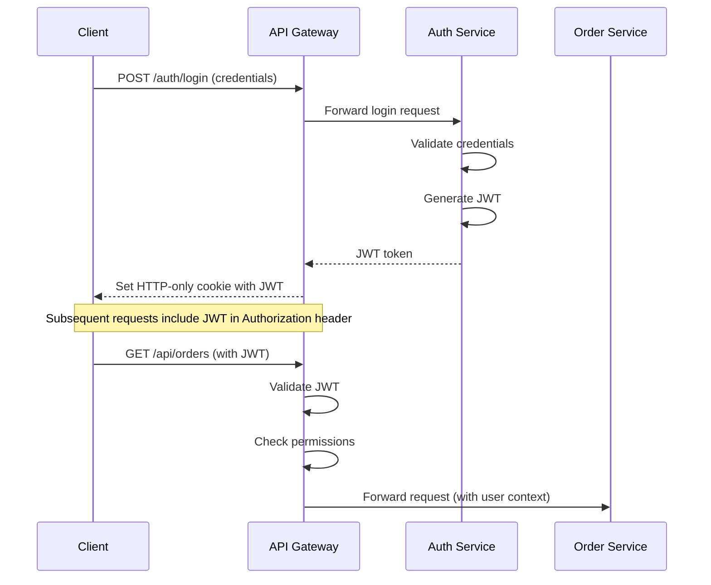
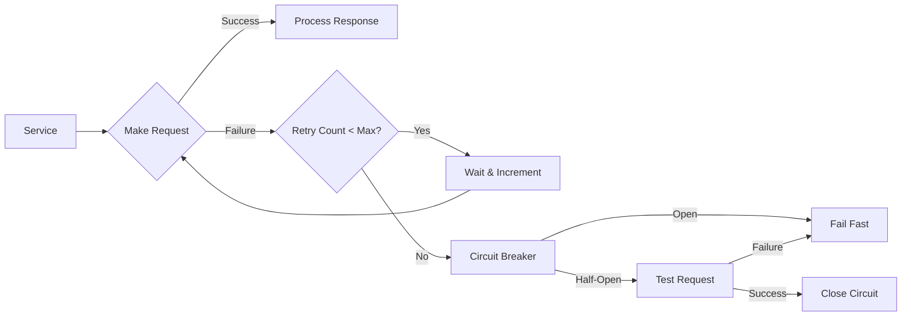

# Data Flow

## Overview

This document describes the flow of data through the SattzaBite system, including request/response patterns, event-driven communication, and data synchronization between services.

## Request/Response Flow

### 1. User Places an Order



### 2. Restaurant Updates Order Status



## Event-Driven Communication

### 1. Order Lifecycle Events



### 2. Event Types and Consumers

| Event Type | Produced By | Consumed By | Description |
|------------|-------------|-------------|-------------|
| OrderCreated | Order Service | Notification, Analytics | Triggered when a new order is created |
| OrderStatusUpdated | Order Service | Notification, User Service | When order status changes |
| PaymentProcessed | Payment Service | Order, Notification | Payment completion event |
| MenuItemUpdated | Food Catalog | Search, Cache | When menu item details change |
| RestaurantStatusChanged | Restaurant Service | Search, Notification | Restaurant open/close status |
| UserPreferenceUpdated | User Service | Recommendation | When user updates preferences |

## Data Synchronization

### 1. CQRS Pattern



### 2. Cache Invalidation Flow



## Cross-Service Data Access

### 1. Service-to-Service Communication

**Synchronous (REST/HTTP):**
- Service discovery via Eureka
- Load balanced with Spring Cloud LoadBalancer
- Circuit breakers for fault tolerance

**Asynchronous (Kafka):**
- Event-driven architecture
- Exactly-once delivery semantics
- Dead letter queues for failed messages

### 2. Data Consistency Patterns

**Saga Pattern:**
- For distributed transactions
- Compensating transactions for rollback
- Example: Order cancellation after payment

**Outbox Pattern:**
- Reliable event publishing
- Prevents dual-write problem
- Transactional outbox table

## Real-time Updates

### 1. WebSocket Flow



### 2. Server-Sent Events (SSE)

Used for:
- Order status updates
- Promotions and offers
- System notifications

## File and Media Handling

### 1. Image Upload Flow



## Search and Analytics

### 1. Search Indexing Flow



## Security Data Flow

### 1. Authentication Flow



## Error Handling and Retries

### 1. Retry Mechanism



## Monitoring and Logging

### 1. Log Aggregation

```
[Service] -> [Logstash] -> [Elasticsearch] <-> [Kibana]
                     |
                     v
              [Archive (S3)]
```

### 2. Metrics Collection

```
[Service (Micrometer)] -> [Prometheus] <-> [Grafana]
```

## Conclusion

This data flow documentation provides a comprehensive view of how data moves through the SattzaBite system. The architecture is designed to be:

1. **Scalable**: Horizontal scaling of stateless services
2. **Resilient**: Circuit breakers, retries, and fallbacks
3. **Maintainable**: Clear separation of concerns
4. **Observable**: Comprehensive logging and monitoring
5. **Secure**: End-to-end encryption and proper authentication/authorization

Understanding these data flows is crucial for development, debugging, and optimizing the system's performance.
