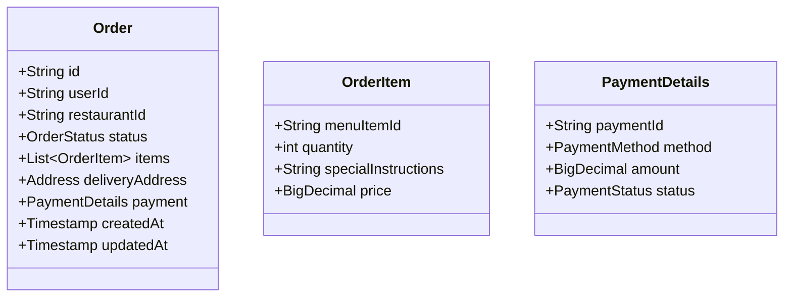
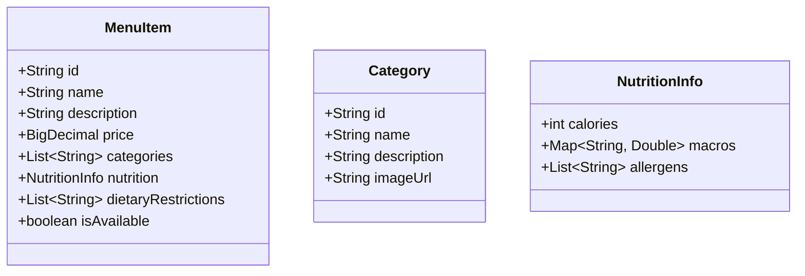
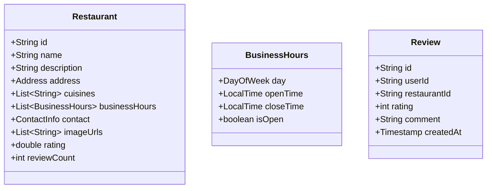

# Microservices Architecture

## Overview

SattzaBite is built using a microservices architecture to ensure scalability, maintainability, and independent deployability. This document provides detailed information about each microservice, its responsibilities, and how they interact with each other.

## Core Services

### 1. API Gateway

**Responsibilities:**
- Single entry point for all client requests
- Request routing and load balancing
- Authentication and authorization
- Rate limiting and throttling
- Request/response transformation
- API versioning

**Key Technologies:**
- Spring Cloud Gateway
- Spring Security
- Resilience4j
- Spring Cloud Circuit Breaker

**Endpoints:**
- `/api/orders/**` - Routes to Order Service
- `/api/menu/**` - Routes to Food Catalog Service
- `/api/restaurants/**` - Routes to Restaurant Service
- `/api/users/**` - Routes to User Service

### 2. Service Registry (Eureka)

**Responsibilities:**
- Service registration and discovery
- Load balancing
- Health monitoring
- Service metadata management

**Key Technologies:**
- Spring Cloud Netflix Eureka
- Spring Boot Actuator

### 3. Order Service

**Responsibilities:**
- Order creation and management
- Order status tracking
- Payment processing integration
- Order history and analytics

**Data Model:**

**Key APIs:**
- `POST /api/orders` - Create a new order
- `GET /api/orders/{orderId}` - Get order details
- `PUT /api/orders/{orderId}/status` - Update order status
- `GET /api/orders/users/{userId}` - Get user's order history

### 4. Food Catalog Service

**Responsibilities:**
- Menu management
- Food item categorization
- Search and filtering
- Nutritional information

**Data Model:**

**Key APIs:**
- `GET /api/menu/items` - Get all menu items
- `POST /api/menu/items` - Add new menu item
- `GET /api/menu/items/{id}` - Get menu item details
- `GET /api/menu/categories` - Get all categories

### 5. Restaurant Service

**Responsibilities:**
- Restaurant profile management
- Operating hours
- Location services
- Ratings and reviews

**Data Model:**

**Key APIs:**
- `GET /api/restaurants` - Get all restaurants
- `POST /api/restaurants` - Add new restaurant
- `GET /api/restaurants/{id}` - Get restaurant details
- `POST /api/restaurants/{id}/reviews` - Add restaurant review

## Supporting Services

### 6. User Service

**Responsibilities:**
- User authentication and authorization
- Profile management
- Address book
- Preferences and settings

### 7. Notification Service

**Responsibilities:**
- Email notifications
- SMS alerts
- Push notifications
- Notification preferences

### 8. Payment Service

**Responsibilities:**
- Payment processing
- Refund handling
- Payment method management
- Transaction history

### 9. Search Service

**Responsibilities:**
- Full-text search
- Advanced filtering
- Autocomplete suggestions
- Search analytics

## Cross-Cutting Concerns

### 1. Distributed Tracing
- **Implementation**: OpenTelemetry with Jaeger
- **Features**: End-to-end request tracing, Performance analysis

### 2. Logging
- **Implementation**: ELK Stack (Elasticsearch, Logstash, Kibana)
- **Features**: Centralized logging, Log aggregation, Real-time analysis

### 3. Monitoring
- **Implementation**: Prometheus and Grafana
- **Features**: Metrics collection, Visualization, Alerting

### 4. Caching
- **Implementation**: Redis
- **Features**: Distributed caching, Cache invalidation, Multi-level caching

## Service Communication

### Synchronous Communication
- **Protocol**: HTTP/HTTPS
- **Content Type**: JSON
- **Client**: WebClient (reactive), RestTemplate (legacy)
- **Load Balancing**: Client-side with Spring Cloud LoadBalancer

### Asynchronous Communication
- **Broker**: Apache Kafka
- **Message Format**: JSON
- **Key Topics**:
  - `order-events` - Order status updates
  - `payment-events` - Payment processing events
  - `notification-events` - Notification triggers
  - `inventory-updates` - Menu item availability updates

## Data Consistency

### Saga Pattern
- **Use Case**: Distributed transactions across services
- **Implementation**: Choreography-based saga using Kafka
- **Compensation Actions**: For handling failures in long-running transactions

### Event Sourcing
- **Use Case**: Maintaining audit trails and enabling temporal queries
- **Implementation**: EventStoreDB
- **Benefits**: Complete history of changes, Event replay capability

## Security

### Authentication
- **Method**: JWT (JSON Web Tokens)
- **Provider**: OAuth 2.0 / OIDC
- **Token Storage**: HTTP-only cookies

### Authorization
- **Method**: Role-based access control (RBAC)
- **Implementation**: Spring Security + Custom annotations
- **Scopes**: Service-level and endpoint-level permissions

### Data Protection
- **In Transit**: TLS 1.3
- **At Rest**: AES-256 encryption
- **Sensitive Data**: Field-level encryption

## Deployment Strategy

### Containerization
- **Runtime**: Docker
- **Base Images**: AdoptOpenJDK (for JVM services), Alpine Linux (for minimal footprint)

### Orchestration
- **Platform**: Kubernetes
- **Features**:
  - Auto-scaling (HPA)
  - Self-healing
  - Rolling updates
  - Canary deployments

### Service Mesh
- **Implementation**: Istio
- **Features**:
  - Advanced traffic management
  - mTLS between services
  - Observability
  - Policy enforcement

## Development Workflow

### Local Development
- **Tools**: Docker Compose, Skaffold
- **Dependencies**: LocalStack (for AWS services), Testcontainers

### CI/CD
- **CI**: GitHub Actions
- **CD**: ArgoCD
- **Environments**:
  - `dev` - Development environment
  - `staging` - Pre-production environment
  - `prod` - Production environment

## Performance Considerations

### Caching Strategy
- **L1 Cache**: In-memory (Caffeine)
- **L2 Cache**: Redis (distributed)
- **Cache Invalidation**: Time-based + Event-based

### Database Optimization
- **Indexing**: Proper indexing on frequently queried fields
- **Sharding**: Horizontal partitioning of data
- **Read Replicas**: For read-heavy workloads

### Asynchronous Processing
- **Non-blocking I/O**: WebFlux for reactive programming
- **Background Jobs**: Quartz Scheduler for scheduled tasks

## Future Enhancements

1. **Feature Flags**
   - Dynamic feature toggles
   - A/B testing framework
   - Gradual rollouts

2. **Machine Learning**
   - Recommendation engine
   - Fraud detection
   - Demand prediction

3. **Multi-tenancy**
   - Support for multiple restaurants
   - White-label solutions
   - Custom branding

## Conclusion

This microservices architecture provides a robust, scalable, and maintainable foundation for the SattzaBite platform. By decoupling services and implementing cross-cutting concerns consistently, we ensure that the system can evolve and scale to meet growing demands while maintaining high availability and performance.
