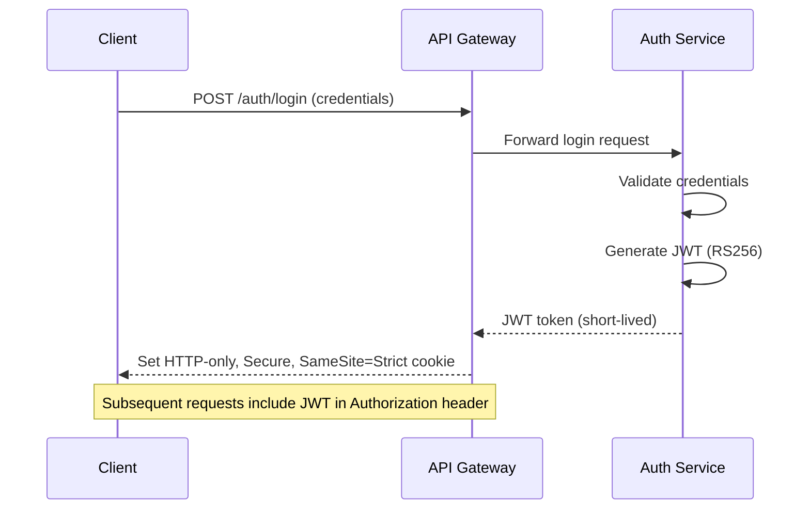

# Security Architecture

## Overview

This document outlines the security measures, protocols, and best practices implemented in the SattzaBite platform to ensure the confidentiality, integrity, and availability of the system and its data.

## Authentication

### JWT-Based Authentication



### Multi-Factor Authentication (MFA)
- **SMS/Email OTP**: For sensitive operations
- **TOTP**: Time-based one-time password support
- **Recovery Codes**: For account recovery

### OAuth 2.0 / OIDC Integration
- Social login providers (Google, Facebook, etc.)
- Identity provider integration
- Token exchange and validation

## Authorization

### Role-Based Access Control (RBAC)

```java
@PreAuthorize("hasRole('RESTAURANT_ADMIN') or hasRole('SYSTEM_ADMIN')")
@PutMapping("/restaurants/{id}/menu")
public ResponseEntity<Menu> updateMenu(@PathVariable String id, @Valid @RequestBody MenuUpdateRequest request) {
    // Implementation
}
```

### Permission Matrix

| Role | Permissions |
|------|-------------|
| CUSTOMER | View menu, Place order, View order history |
| DELIVERY_PARTNER | View assigned orders, Update delivery status |
| RESTAURANT_STAFF | Update order status, Manage menu |
| RESTAURANT_ADMIN | Manage restaurant profile, Manage staff |
| SYSTEM_ADMIN | Manage users, System configuration |

### Attribute-Based Access Control (ABAC)
- Fine-grained access control based on attributes
- Dynamic policy evaluation
- Context-aware authorization

## Data Protection

### Encryption

| Data Type | Encryption Method | Key Management |
|-----------|-------------------|----------------|
| Data in Transit | TLS 1.3 | Certificate Authority |
| Data at Rest | AES-256 | AWS KMS |
| Sensitive Fields | Field-level encryption | Per-field keys |
| Database Fields | Transparent Data Encryption | Database-native |

### Data Masking
- Credit card numbers: `****-****-****-1234`
- Email: `j***@example.com`
- Phone: `+1 (***) ***-1234`

### Secure Storage
- Environment variables for secrets
- Vault integration for sensitive configuration
- Regular secret rotation

## API Security

### Rate Limiting
- Global rate limits
- Per-IP rate limiting
- Per-user rate limiting
- Sliding window algorithm

### Input Validation
- Request validation
- SQL injection prevention
- XSS prevention
- Content Security Policy (CSP)

### Security Headers
```
Strict-Transport-Security: max-age=31536000 ; includeSubDomains
X-Content-Type-Options: nosniff
X-Frame-Options: DENY
X-XSS-Protection: 1; mode=block
Content-Security-Policy: default-src 'self'
Referrer-Policy: no-referrer-when-downgrade
```

## Infrastructure Security

### Network Security
- VPC with private subnets
- Security groups and NACLs
- Web Application Firewall (WAF)
- DDoS protection

### Container Security
- Non-root users in containers
- Read-only filesystems
- Minimal base images
- Regular vulnerability scanning

### Secrets Management
- Environment variables for non-sensitive config
- Vault for secrets
- IAM roles for AWS resources

## Compliance

### GDPR
- Right to be forgotten
- Data portability
- Data processing agreements
- DPO contact information

### PCI DSS
- SAQ A-EP compliance
- No storage of payment details
- Secure payment processing
- Regular security assessments

### ISO 27001
- Information security management system
- Risk assessment and treatment
- Continuous improvement

## Monitoring and Incident Response

### Security Monitoring
- SIEM integration
- Anomaly detection
- Real-time alerts
- Audit logging

### Incident Response Plan
1. **Detection**: Automated monitoring and alerts
2. **Containment**: Isolate affected systems
3. **Eradication**: Remove threat and vulnerabilities
4. **Recovery**: Restore services
5. **Post-Mortem**: Document and learn

### Security Headers Check
```bash
curl -I https://api.sattzabite.com/
```

## Secure Development Lifecycle

### Code Analysis
- Static Application Security Testing (SAST)
- Dynamic Application Security Testing (DAST)
- Dependency scanning
- Container scanning

### Secure Coding Guidelines
- Input validation
- Output encoding
- Secure error handling
- Least privilege principle

### Security Testing
- Penetration testing
- Vulnerability scanning
- Security code reviews
- Threat modeling

## Third-Party Security

### Vendor Assessment
- Security questionnaires
- Compliance certifications
- Security incident history
- Contractual obligations

### API Security
- API key rotation
- Rate limiting
- Request signing
- Audit logging

## Physical Security
- Data center security
- Access controls
- Environmental controls
- Disaster recovery

## Security Training
- Developer security training
- Phishing awareness
- Secure coding practices
- Incident response drills

## Security Contact
For security-related concerns, please contact:
- **Security Team**: security@sattzabite.com
- **PGP Key**: [Link to PGP key]
- **Security Advisories**: [Link to security advisories]

## Conclusion
This security architecture provides a comprehensive framework for protecting the SattzaBite platform. By implementing these measures, we ensure that our system remains secure, compliant, and resilient against potential threats.
